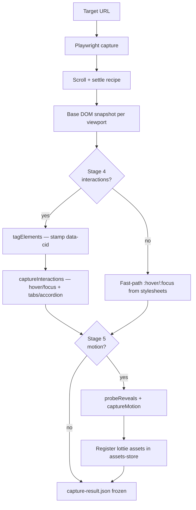
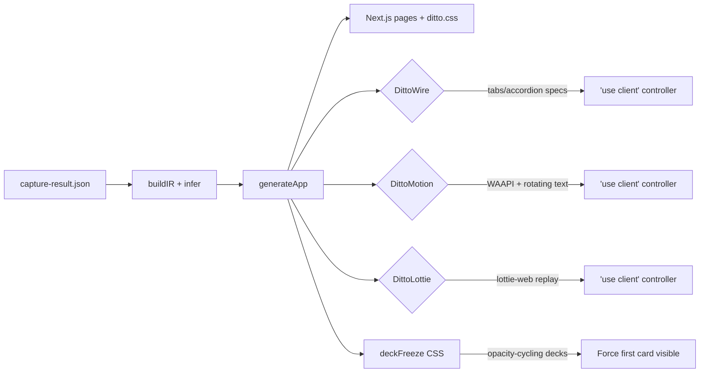
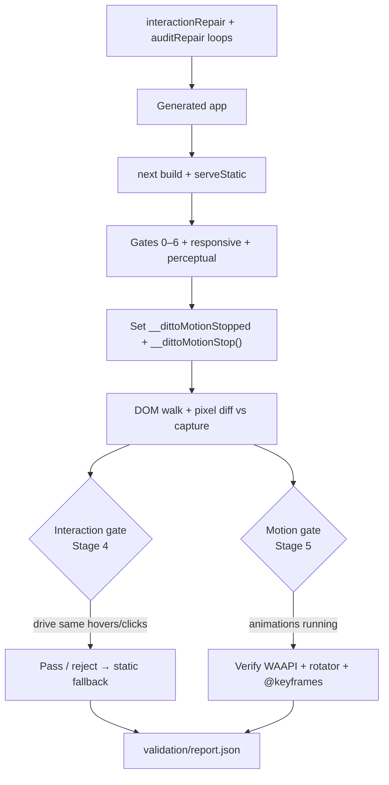

# ditto by ION

[](https://github.com/IS-2020/ditto-by-ion/actions/workflows/ci.yml)
[](https://ditto-by-ion.vercel.app/wizard)
[](LICENSE)

Deterministic website compiler fork of [ditto.site](https://github.com/ion-design/ditto.site). Paste a public URL and get a self-contained Next.js App Router project — capture what the browser actually rendered, then emit byte-stable TypeScript output.

**Live UI:** [https://ditto-by-ion.vercel.app/wizard](https://ditto-by-ion.vercel.app/wizard)  
**Repo:** [github.com/IS-2020/ditto-by-ion](https://github.com/IS-2020/ditto-by-ion)

> Vercel hosts the wizard UI; set `DITTO_WORKER_URL` to a Railway API for live scan/clone, or run locally for the full Playwright stack. Production workloads (Postgres queue, R2 storage, multi-worker): [Railway + Neon](docs/DEPLOY.md).

## First-run onboarding wizard

Open `/wizard` for the guided flow:

1. **Enter URL** — one site per project  
2. **Auto-scan** — discovers ~20 routes; **homepage clone starts immediately** (full quality)  
3. **Pick pages** — top 5 nav routes pre-checked; extra pages queue in the background  
4. **Build view** — 50/50 live vs clone (full-width clone + banner when embed is blocked), stage progress, timer, live file tree + editor, preview updates mirror → Next.js export  
5. **Audit** — pixel diff slider (live witness vs clone); route switcher after build  

Projects are saved in `localStorage` (`ditto_project`) so you can resume URL + selected routes. After onboarding, `/studio` opens the power-user clone UI.

Reset wizard: `localStorage.removeItem('ditto_onboarded')` then reload.

## What's different from upstream ditto.site

| Capability | Description |
|------------|-------------|
| **Onboarding wizard** | First-run flow with scan, route picker, side-by-side build, pixel audit |
| **Site scan API** | `POST /v1/scan` — crawl + route plan for UI checkboxes |
| **Route selection** | `selectedRoutes` on multi-page clones; homepage-first job queue |
| **Live WIP preview** | `/mirror-preview/` during generate; `/app-preview/` after build |
| **Pixel audit UI** | `GET /v1/clones/:id/audit` + diff PNGs per viewport |
| **Pattern catalog v5** | 159 SHA256-pinned patterns + mining scripts |
| **Tier G repair** | Audit-driven layout/style repair loop |
| **Dual deliverable** | Next.js app at `/` plus static HTML mirror at `/static/` |

## Quick start (local)

```bash
git clone https://github.com/IS-2020/ditto-by-ion.git
cd ditto-by-ion

npm ci
npx playwright install chromium
cd compiler/.harness && npm ci && cd ../..

PORT=8899 npm run dev:api
```

- **Wizard:** [http://localhost:8899/wizard](http://localhost:8899/wizard)  
- **Studio:** [http://localhost:8899/studio](http://localhost:8899/studio)

### Clone via API

```bash
# Scan routes
curl -sS -X POST "http://localhost:8899/v1/scan" \
  -H "content-type: application/json" \
  -d '{"url":"https://example.com/","maxRoutes":20}'

# Start clone (homepage only)
curl -sS -X POST "http://localhost:8899/v1/clones" \
  -H "content-type: application/json" \
  -d '{"url":"https://example.com/","options":{"qualityTier":"production","mode":"single"}}'

# Multi-page with selected routes
curl -sS -X POST "http://localhost:8899/v1/clones" \
  -H "content-type: application/json" \
  -d '{"url":"https://example.com/","options":{"qualityTier":"production","mode":"multi","selectedRoutes":["/","/about","/pricing"]}}'
```

Poll progress: `GET /v1/clones/:id/events` · Preview: `/v1/clones/:id/app-preview/`

## REST endpoints

| Method | Path | Purpose |
|--------|------|---------|
| `POST` | `/v1/scan` | Crawl site + return route list for UI |
| `POST` | `/v1/clones` | Start a clone (queued; poll for result) |
| `GET` | `/v1/clones/:id` | Job status + `previewReady` |
| `GET` | `/v1/clones/:id/events` | Pipeline progress events |
| `GET` | `/v1/clones/:id/wip-files` | Generated files during build |
| `GET` | `/v1/clones/:id/wip-files/*` | Read one generated file (live editor) |
| `GET` | `/v1/clones/:id/app-preview/*` | Browsable Next.js static export |
| `GET` | `/v1/clones/:id/mirror-preview/*` | WIP static HTML mirror (mid-build) |
| `GET` | `/v1/clones/:id/audit` | Pixel audit summary + comparison URLs |
| `GET` | `/v1/clones/:id/bundle?format=tgz` | Download the whole app |

## Deploy

| Target | Use case |
|--------|----------|
| **[Vercel](https://ditto-by-ion.vercel.app)** (`vercel.json`) | Wizard UI; proxies clone API when `DITTO_WORKER_URL` is set |
| **[Railway + Neon + R2](docs/DEPLOY.md)** | Production queue, storage, workers |

### Vercel + remote worker

Vercel serves the wizard UI (`vercelUi.ts`) without Playwright. To enable scan and clone on production, deploy the full API to Railway (see [docs/DEPLOY.md](docs/DEPLOY.md)), then set on the Vercel project:

| Variable | Example | Purpose |
|----------|---------|---------|
| `DITTO_WORKER_URL` | `https://api.yourdomain.com` | Primary — Vercel proxies `/v1/scan` and `/v1/clones*` here |
| `CLONE_API_URL` | (same) | Fallback alias if `DITTO_WORKER_URL` is unset |

Without either variable, the wizard skips route discovery and shows a banner; clone jobs still require the worker (or local `PORT=8899 npm run dev:api`).

```bash
# Vercel (from repo root)
vercel --prod
```

## CLI (compiler)

```bash
cd compiler
CATALOG_ONLY_HINTS=true npm run clone -- https://example.com/ --runs=../runs --viewports=1280 --validate
```

## Architecture

Deterministic pipeline: Playwright capture freezes evidence → IR inference → Next.js generation → graded validation. The diagrams below reflect the code as it exists today.

### Capture pipeline

Playwright loads the target URL with a deterministic env shim (seeded `Math.random`, pinned epoch), scrolls for lazy content, then stamps `data-cid` anchors before the canonical snapshot. Optional stages run only when enabled (production tier turns them on by default).



| Stage | Module | Output |
|-------|--------|--------|
| Base | `capture/capture.ts` | `dom-*.json`, live witness, assets-store |
| Stage 4 | `capture/interactions.ts` | Hover/focus deltas, recognized wire specs |
| Stage 5 | `capture/motion.ts`, `capture/lottie.ts` | WAAPI specs, rotating text, Lottie JSON refs |

### Generation

`generateAll` (`generate/pipeline.ts`) builds IR from the frozen capture, runs inference (sections, tokens, pattern catalog hints), then `generateApp` emits the Next.js project plus runtime controllers.



| Runtime | Emitted when | Role |
|---------|--------------|------|
| **DittoWire** | Stage 4 wire specs survive the interaction gate | Client-side tabs/accordion/display-toggle reproduction |
| **DittoMotion** | WAAPI or rotating-text motion captured | Replays animations on mount; honors `__dittoMotionStopped` |
| **DittoLottie** | Lottie JSON assets discovered | Replays Lottie via lottie-web; same stop hook as DittoMotion |
| **deckFreeze** | Opacity-cycling sibling stacks in IR | CSS normalizer — show first stacked card for static gates |

### Validation gates + freeze

Validation re-renders the **built** clone against captured evidence — no live URL is re-fetched. Static gates (0–6, responsive, perceptual) measure the **settled** frame; motion is verified separately.



Before static measurement, the validator sets `window.__dittoMotionStopped` so DittoMotion/DittoLottie skip hydration-time replay, then calls `__dittoMotionStop()` to restore rotator text and cancel running animations. The motion gate drives an **un-stopped** page to confirm animations actually run.

### API & service flow

Local/Railway runs the full Hono API (`packages/api/src/app.ts`); Vercel serves a slim UI-only bundle (`vercelUi.ts`) because Playwright cannot run in serverless.

```mermaid
flowchart TD
  subgraph clients [Clients]
    W[/wizard]
    S[/studio]
    REST[REST / MCP]
  end
  subgraph tiers [qualityTier defaults]
    Prod[production — 4 viewports, interactions, motion, verify]
    Dev[dev — cache-friendly, no verify]
    Draft[draft — 1280 only, no Stage 4/5]
  end
  W --> Scan[POST /v1/scan]
  W --> Clone[POST /v1/clones]
  S --> Clone
  REST --> Clone
  Clone --> Tier[applyQualityTier]
  Tier --> Prod
  Tier --> Dev
  Tier --> Draft
  Clone --> Runner[@cloner/core job runner]
  Runner --> Compiler[compiler capture → generate → validate]
  Runner --> WIP[/mirror-preview/ during build]
  Runner --> Preview[/app-preview/ after next export]
  Runner --> Audit[GET /v1/clones/:id/audit]
  Runner --> Behavior[behaviorAudit — interaction roadmap]
  subgraph vercel [Vercel demo]
    VUI[vercelUi.ts — wizard + studio HTML]
    V503[503 on /v1/* clone endpoints]
  end
  W -.->|hosted| VUI
  VUI --> V503
```

Wizard flow: scan routes → start homepage clone at `production` → poll `/v1/clones/:id/events` → live WIP files + mirror preview → pixel audit slider. Multi-page expansion queues selected routes after the homepage job succeeds.

## Repository map

| Path | Purpose |
|------|---------|
| `compiler/` | Capture, inference, generation, validation |
| `packages/api/` | Hono REST API, wizard, studio UI, Vercel entry |
| `packages/core/` | Clone job runner, site scan, app preview |
| `api/index.ts` | Vercel serverless handler |
| `docs/` | Methodology, service, deployment |

## Responsible use

Use only where you have the right to inspect and copy the target. See [docs/RESPONSIBLE_USE.md](docs/RESPONSIBLE_USE.md).

## License

MIT © ion-design and contributors. See [LICENSE](LICENSE).
